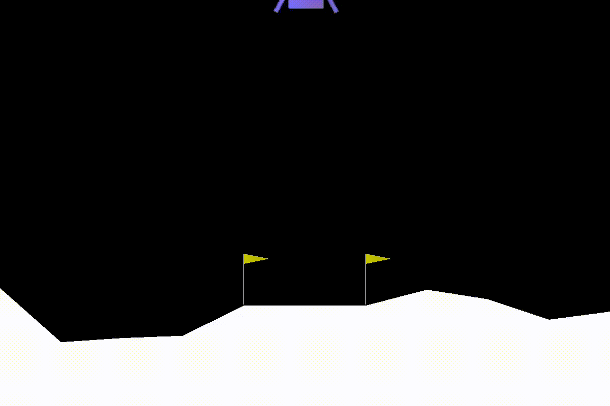

# lunar lander
Solving the Lunar-Lander-v2 environment in the OpenAI Gym using a Double
Q-Learning Network.



## install
```
pip install -r requirements.txt
```

## running
Check out the *ddqn.ipynb* notebook to see how to run the code
